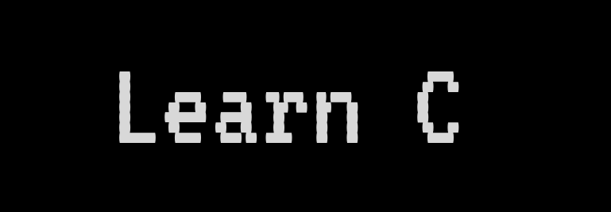

  
  
  
  <h4>Educational material and examples for those interested in learning the C programming language</h4>
  

<h2>Files</h2>

<strong>examples.c</strong> 
Various examples of programs written in C. Each examples has a small introduction. Code written by me from scratch. One single long file with thousands of lines. You might wanna try searching if you need something specific. Pull requests and issues for corrections are always welcome. 
